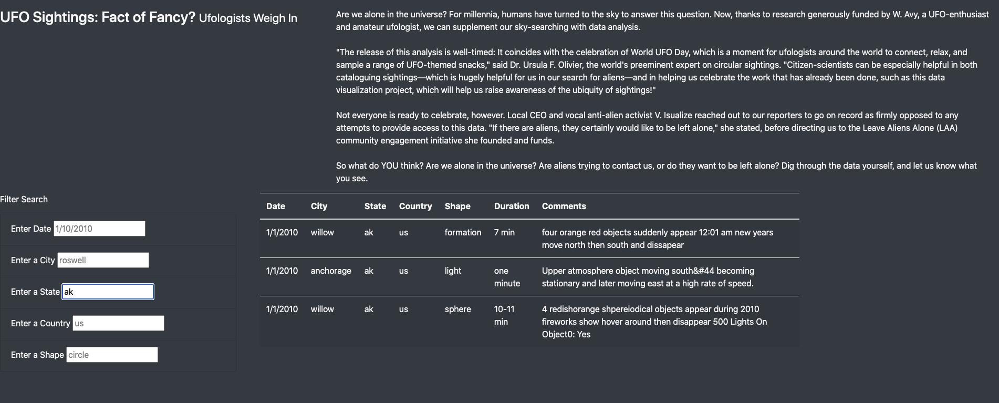

# UFO Sighting!
## Overview of the Analysis:

### Purpose 
The purpose of this analysis is to help Dana, a data journalist create a website to provide a more in-depth analysis of UFO sightings by allowing users to filter for multiple criteria at the same time. In addition to the date, there will be table filters for the city, state, country, and shape.

## Results:

There is a description of how to perform a search, with images. (4 pt)
To perform a search, you must use one of the filters. We will use state for this example; input ak in the state search box and press enter this will filter out the UFO findings for the state AK. The other search boxes can be used as well, but only one search at a time meaning not all of the search boxes can be utilized. As you can see above, AK was populated into the search box for state and only ak state UFO related data appeared. Lastly see below: to clear the search, press the button on the top left corner "UFO Sighting" and you will be ready for a new search.

## Summary:

A drawback of this webpage would be the limited search box being used, for this search page only one search box can be used to filter out the UFO sightings at a time. This is an issue as one may want to filter out a city and state. Some reccomendation for further developement would be allowing to use all of the search boxes with any number of combinations when searching, this will be more user friendly for the audience and another useful thing would be to allow more than one key word search for one search box. For example; city having two citites being searched for.
